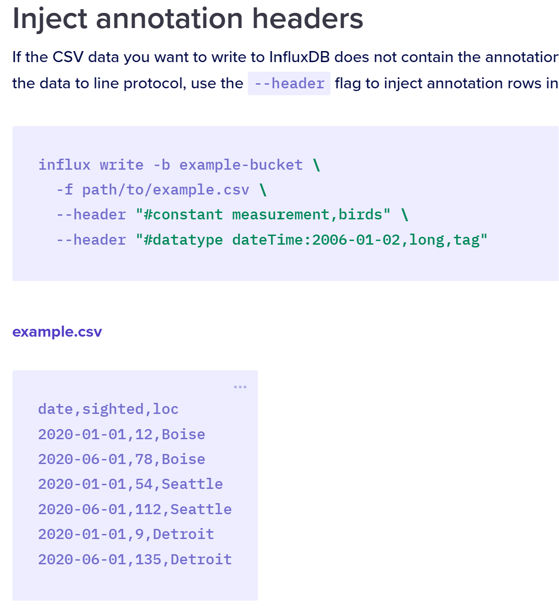

= Hello
Doc Writer <tommyf2000@web.de>
:toc: left

== Section1
this is my first asciidoc page

=== Section1a
sdfnjsdfö
 

== Cool?

Yes
[cols="1,1"]
|===
|Cell in column 1, header row |Cell in column 2, header row 

|Cell in column 1, row 2
|Cell in column 2, row 2

|Cell in column 1, row 3
|Cell in column 2, row 3

|Cell in column 1, row 4
|Cell in column 2, row 4
|===
